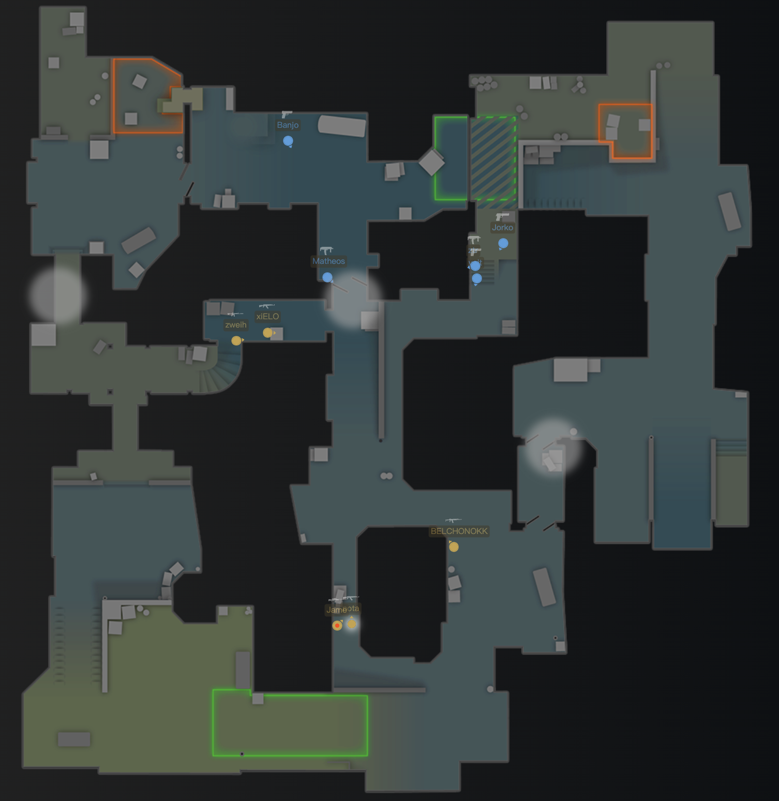
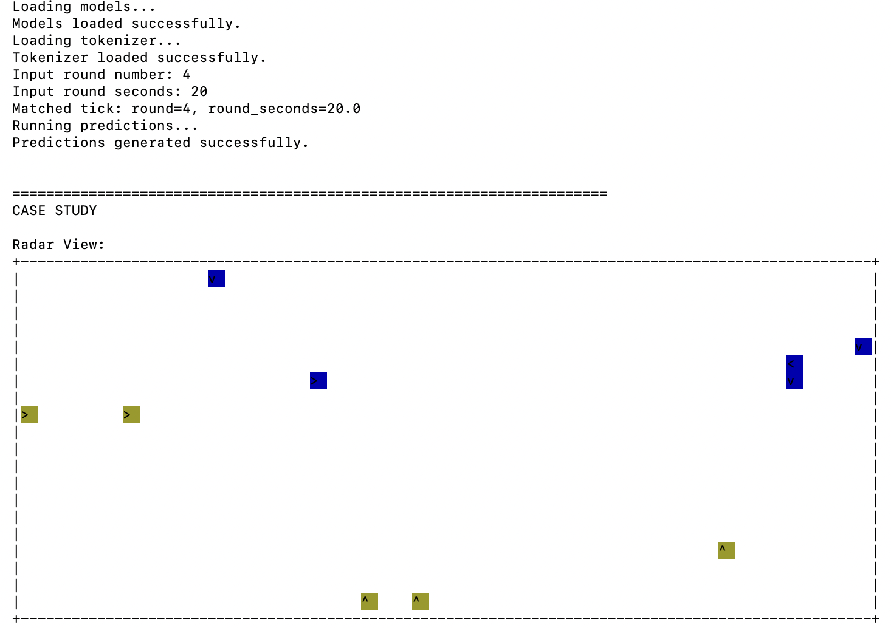

<p align="center">
  
</p>

<h1 align="center">CS-NET</h1>

<p align="center">
  <strong>A deep learning framework for Counter-Strike match data analysis</strong>
</p>

<p align="center">
  
  
  
</p>

---

## 📌 Project Overview

TODO

## 🚀 Quick Start

### 1. Setup Environment

Create a Python environment and install dependencies:

```bash
conda create -n cs-net python=3.10
conda activate cs-net
pip install -r requirements.txt
```

### 2. Download Pre-trained Models

Download all pre-trained models and tokenizers to `./cs-net-models/`:

```bash
python -m examples.download_model
```

### 3. Convert Demo to JSON

Process a Counter-Strike demo file (.dem) into structured JSON format:

`examples/test.dem` is intentionally NOT included in this repository because demo files are too large.
You must download a `.dem` file yourself (for example from HLTV) and replace the input path.

```bash
python -m data.process_demo \
  -path examples/test.dem \
  -interval 0.25 \
  -out examples/test.json
```

### 4. Run Case Study & Visualization

Generate predictions and visualizations using the processed data:

```bash
python -m examples.case_study \
  --json_path examples/test.json \
  --alive_ckpt_dir cs-net-models/alive \
  --kill_ckpt_dir cs-net-models/nxt_kill \
  --winrate_ckpt_dir cs-net-models/win_rate \
  --duel_ckpt_dir cs-net-models/duel \
  --device cpu
```

**Note on `--device` flag:**
- Use `cuda` for NVIDIA GPUs
- Use `mps` for Apple Silicon (M1/M2/M3)
- Use `cpu` for CPU-only inference

### 5. How to Read Case Study Output

The case study prints an ASCII radar and multiple prediction blocks in the terminal.

Ground-truth radar frame (from demo):



Radar view printed by case_study:



Interpretation:
- The first image is the real in-game radar frame at the selected round/time.
- The second image is the radar view shown by case_study for the same moment.
- You should compare these two views to confirm the selected tick and player layout are aligned before trusting the predictions.

Console output (full example):

```text
======================================================================
Round: 4 | Time: 20.00s

CT Win Rate:
  0.1121

Alive Prediction:
  ztr             0.1372
  nota            0.5957
  xiELO           0.4869
  Matheos         0.1589
  zweih           0.5235
  volt            0.2621
  BELCHONOKK      0.4544
  Jame            0.5232
  Banjo           0.3307
  Jorko           0.3546

Next Killer Distribution:
  ztr             0.0808
  nota            0.1471
  xiELO           0.1298
  Matheos         0.1350
  zweih           0.1449
  volt            0.0737
  BELCHONOKK      0.0723
  Jame            0.0711
  Banjo           0.0802
  Jorko           0.0638
  <NO KILL>       0.0012

Next Death Distribution:
  ztr             0.1537
  nota            0.0676
  xiELO           0.1113
  Matheos         0.0912
  zweih           0.1023
  volt            0.1513
  BELCHONOKK      0.0910
  Jame            0.0704
  Banjo           0.0621
  Jorko           0.0981
  <NO DEATH>      0.0009

Duel Matrix (CT vs T)
P[CT beats T]

                     nota     xiELO     zweihBELCHONOKK      Jame
ztr                 0.330     0.414     0.352     0.435     0.310
Matheos             0.510     0.563     0.541     0.598     0.459
volt                0.337     0.402     0.395     0.499     0.359
Banjo               0.470     0.554     0.514     0.578     0.456
Jorko               0.361     0.480     0.439     0.520     0.369

======================================================================
```

Detailed explanation of each section:
1. `Round: X | Time: Ys`
  Confirms which tick is actually matched after you input round/time.
1. `CT Win Rate`
  A scalar in `[0, 1]`, where higher means CT side is more likely to win the round at this moment.
1. `Alive Prediction`
  Per-player survival probability. If a player is already dead in this tick, output shows `DEAD`.
1. `Next Killer Distribution`
  Probability distribution of who gets the next kill. `<NO KILL>` means no kill event is expected next.
1. `Next Death Distribution`
  Probability distribution of who dies next. `<NO DEATH>` means no death event is expected next.
1. `Duel Matrix (CT vs T)`
  Each cell is `P[CT beats T]` for a CT-T pair. Values above `0.5` indicate CT advantage in that duel.

## 🤝 Contributors

- [Gary2005](https://github.com/Gary2005)
- [czdzx](https://github.com/czdzx)